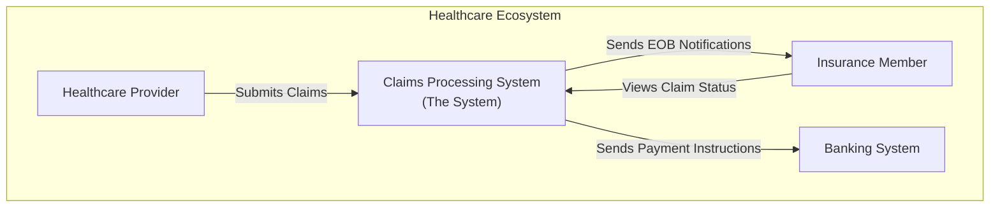
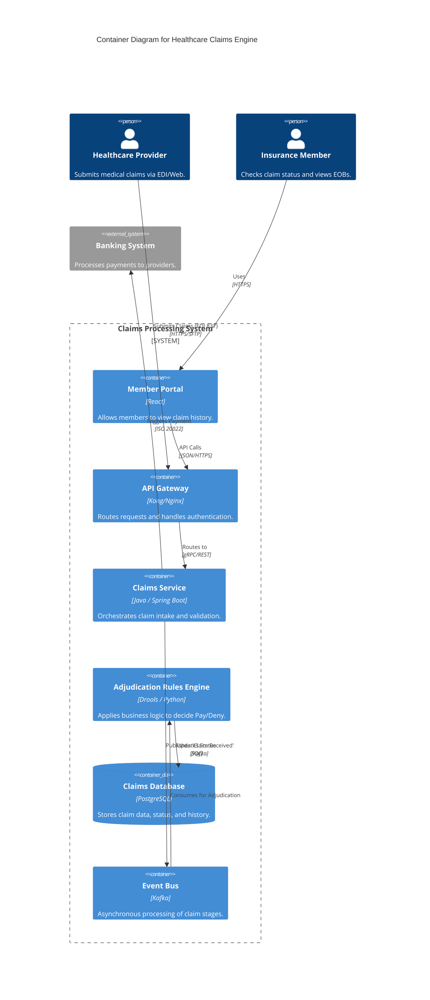
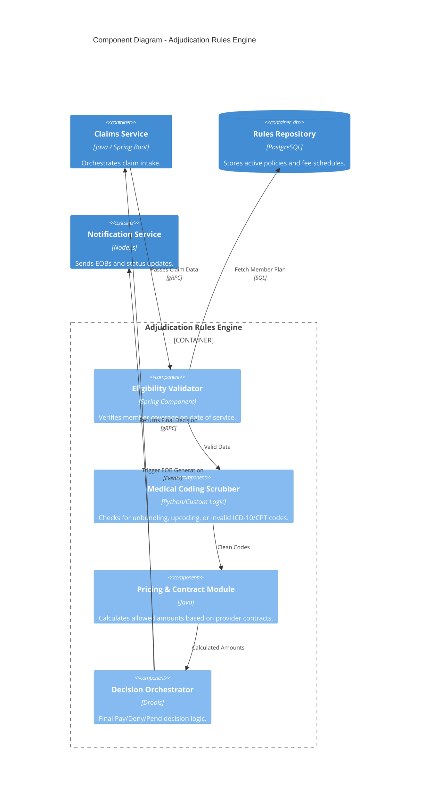
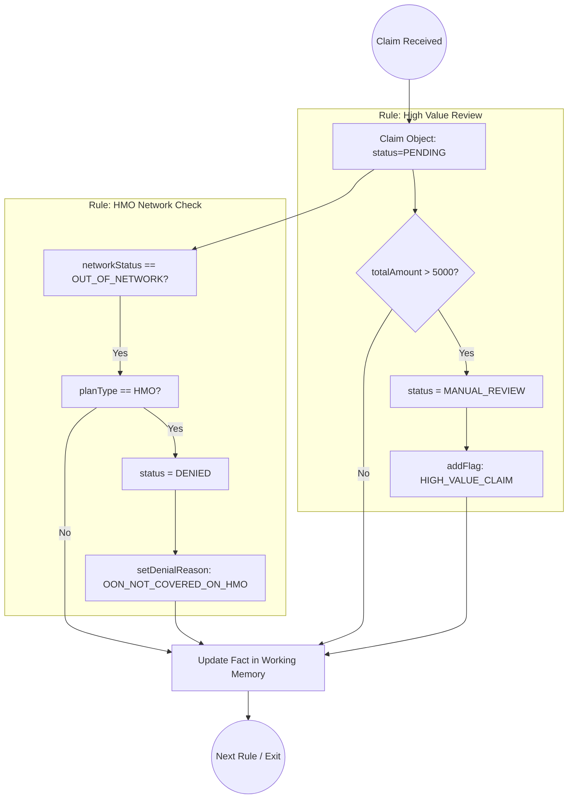
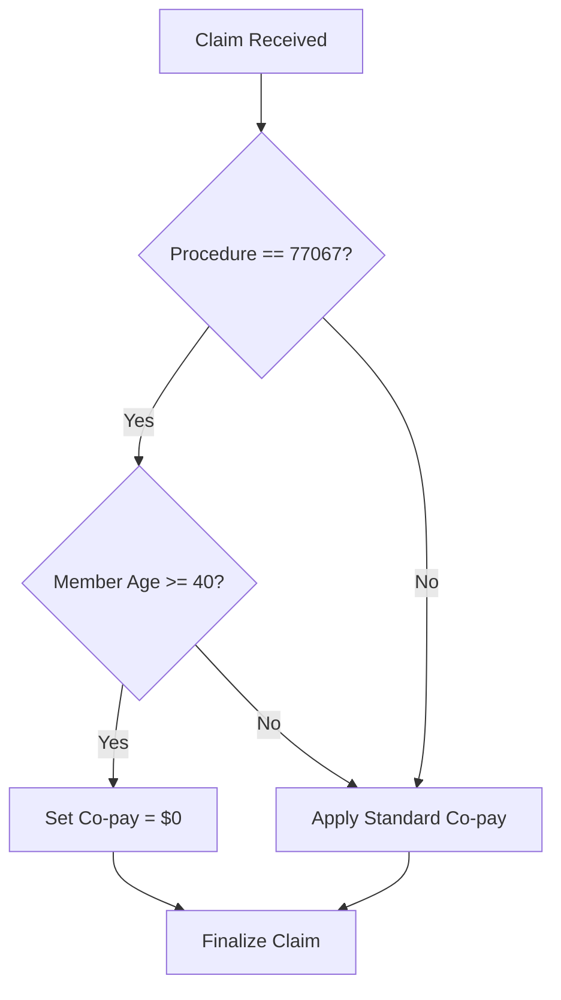

1. System Context Diagram\
This level shows the Claims Engine as a "black box" and how it interacts with external actors<br> like Healthcare Providers and Insurance Members.



2. Container Diagram\
This is the most useful level for developers. It decomposes the system into high-level<br> technology building blocks (Containers).


Key Components Explained\
-  API Gateway: Essential for healthcare to handle HIPAA-compliant encryption and various<br> entry points (Electronic Data Interchange or REST APIs).

-  Adjudication Rules Engine: The "brain" of the engine. It checks if the member is active, if<br> the service is covered, and calculates the co-pay or deductible.

-  Event Bus (Kafka): Claims processing is often long-running. Using an event-driven<br> architecture allows the system to scale during high-volume periods (like the end of a plan<br> year).

-  Claims Database: Holds the "Source of Truth" for every claim version submitted.

3. Component Diagram: Adjudication Rules Engine\
This diagram focuses on the internal logic responsible for processing a claim once it has been<br> validated by the Claims Service.


Key Logic Modules
-  Eligibility Validator: The first "gate." If the member wasn't covered on the day they saw<br> the doctor, the claim is rejected immediately.

-  Medical Coding Scrubber: This ensures the "Clinical Integrity" of the claim. For example,<br> it checks if a provider is billing for two procedures that are actually part of the same single<br> surgery (preventing "unbundling").
-  Pricing & Contract Module: This is where the financial math happens. It looks up the<br> agreed-upon rate between the insurer and the doctor.  
    -  Calculation: $Allowed Amount - (CoPay + Deductible) =\\ Insurance Payment$
-  Decision Orchestrator: The final step that aggregates all flags. If the Coding Scrubber<br> finds a mismatch but the Eligibility is fine, it might "Pend" the claim for a human auditor to<br> review.
<br>

4. Implementation Details (The "Code" Level)\
While C4 usually stops at components for architectural discussions, here is a conceptual,br snippet of how the Adjudicator might look in a rules-based language like Drools (DRL):
```
rule "Mark for Manual Review if total exceeds $5000"
    when
        $c : Claim( totalAmount > 5000, status == "PENDING" )
    then
        $c.setStatus("MANUAL_REVIEW");
        $c.addFlag("HIGH_VALUE_CLAIM");
        update($c);
end

rule "Deny if Provider is Out of Network"
    when
        $c : Claim( networkStatus == "OUT_OF_NETWORK", planType == "HMO" )
    then
        $c.setStatus("DENIED");
        $c.setDenialReason("OON_NOT_COVERED_ON_HMO");
        update($c);
end
```
Since we are looking at the logic inside a single component, we use the C4 Component Level<br> to zoom into how these specific rules are evaluated.

In a Drools engine, these rules are part of a Production Memory where the engine matches<br> "Facts" (the Claim) against "Conditions" (the when clause).

C4 Component Logic Graph\
We can represent these specific Drools rules as a decision flow within the Adjudicator<br> Component.


To show you how these three concepts work together, let’s take one specific healthcare<br> business requirement and trace it through the entire lifecycle.

The Requirement: "If a claim is for a Mammogram (CPT 77067), and the member is over 40,<br> the Co-pay should be waived ($0)."

1. The C4 Plan (The "Philosophy")
In the C4 framework, we decide where this logic lives. We determine that this isn't a "system-<br>wide" thing; it’s a specific Component inside the Adjudication Engine.

-  Level: L3 (Component)

-  Decision: Create a "Preventative Care Module" to handle zero-dollar co-pay logic.

2. The Mermaid Drawing (The "Documentation")
Now, we use Mermaid to visualize that logic so the Business Analysts can verify the rule is<br> correct.


3. The Drools Code (The "Reality")
Finally, we write the actual Drools code that runs on the server. This looks similar to the<br> Mermaid logic, but it is written in a way the computer can execute.
```
rule "Preventative Mammogram Co-pay Waiver"
    when
        $m : Member( age >= 40 )
        $c : Claim( procedureCode == "77067", memberId == $m.id )
    then
        $c.setCopayAmount(0.00);
        $c.addNote("Preventative care benefit applied.");
        update($c);
end
```

Comparison Summary\


| Feature      | C4                                | Mermaid                | Drools                    |
|--------------|-----------------------------------|------------------------|---------------------------|
| Output       | A strategy for organization.      | A .png or .svg image.  | A processed transaction.  |
| User         | Architect / Stakeholder.          | Developer / Analyst.   | The Server / Database.    |
| Example.     | "Rules live in the Adjudicator."  | B {Age > 40?}.         | Member( age >= 40 ).      |
|              |                                   |                        |                           |

Why this matters<br>
If you only have Drools, you have a "black box" that no one understands. If you only have<br> Mermaid, you have a pretty picture but a manual process. If you use C4 to organize them<br> both, you have a professional, scalable healthcare platform.

Best Resources to Deepen Your Knowledgeo of C4

-  Official Website (c4model.com): The definitive guide. Read the "Notation" section—it's short<br> and highly practical.

-  Simon Brown’s Talks: Search YouTube for "Visualising software architecture with the C4<br> model." His 2019 "Agile on the Beach" talk is the gold standard introduction.

-  Architecture Katas: Take a small problem (e.g., "Build a parking lot management<br> system") and try to draw the L1 and L2 diagrams for it.


To learn Drools effectively, you should transition from the "logic diagrams" we discussed into<br> the Java-based reality of the engine. Drools has a steep learning curve because it requires<br> both a business mindset (for rules) and a technical mindset (for Java/Maven).

Here are the top resources to move from beginner to expert:

1. Hands-On Video Courses (Best for Quick Progress)

-  Udemy: "Master Drools Programming" This is widely considered the gold standard for<br> developers. It covers the Drools Rule Language (DRL) syntax, decision tables, and the<br> "Phreak" algorithm (the brain of the engine).

-  Java Techie (YouTube): A fantastic free resource if you want to see how to integrate<br> Drools with Spring Boot. It bridges the gap between writing a rule and actually making it<br> work in a modern web app.

2. Interactive Documentation & Practice

-  Official Drools Documentation (docs.drools.org): The "Getting Started" guide is<br> excellent for setting up your first "Traffic Violation" project. It’s updated for 2025 and<br> covers both DRL and DMN (Decision Model and Notation).

-  TutorialsPoint & Baeldung: Use these for "Cheat Sheet" style learning. They are perfect<br> for looking up specific syntax like salience, agenda-groups, or accumulate functions.

3. Books & Deep Dives

-  "AI and Business Rule Engines for Excel Power Users" (2023): Great if you want to<br> understand how to bridge the gap between business analysts using Excel and the Drools<br> engine.

-  "Mastering Drools" by Federico Tomassetti: His blog and book are high-level deep<br> dives into how the engine handles complex event processing (CEP).

4. The "Learning Path" Strategy

If you want to master Drools, follow this order:

1.  Learn Basic DRL Syntax: Understand when (Conditions) and then (Actions).

2.  Stateful vs. Stateless Sessions: Learn when to keep memory of facts versus when to<br> treat every request as brand new.

3.  Conflict Resolution: Master salience (priority) to control which rules fire first.

4.  Integration: Learn how to pass Java POJOs (Plain Old Java Objects) into the engine.